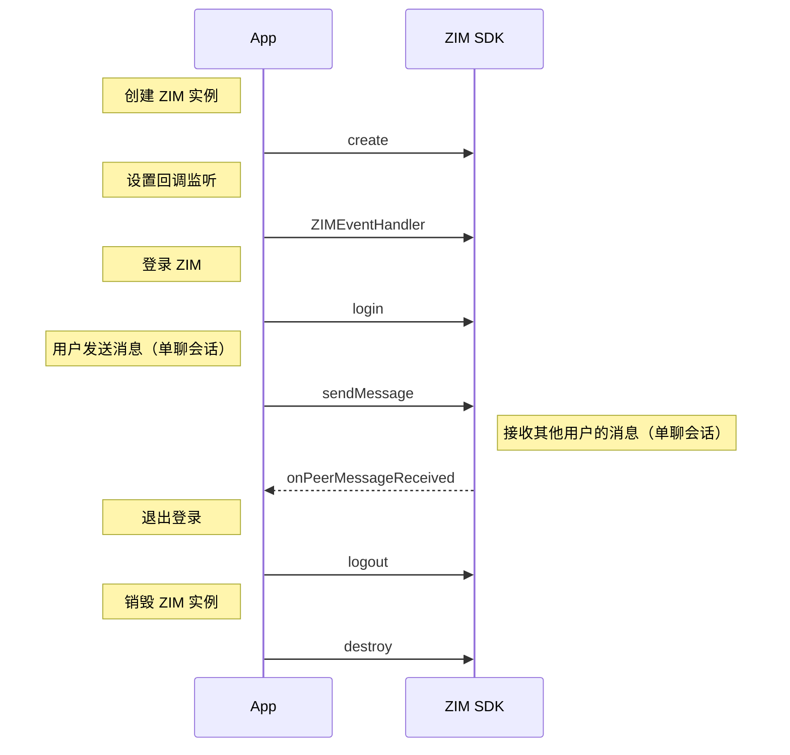

import MarkMessageType from '/core_products/zim/zh/snippets/MessageType.mdx'
import MarkSendMessageEvent from '/core_products/zim/zh/snippets/SendMessageEvent.mdx'

# 实现基本消息收发

--- 

本文介绍如何使用 ZIM SDK 快速实现基本的单聊会话消息收发功能。

<Note title="说明">

本文档适用于开发以下平台的应用：iOS、Android、HarmonyOS、macOS、Windows、Web。
</Note>

## 1 前提条件

在使用 ZIM SDK 前，请确保：

- 开发环境与测试设备满足以下要求：
    <Tabs>
    <Tab title="不适用于 HarmonyOS App 开发">
    - 开发环境：
        - 已安装 Flutter。
        - 已安装 Dart 且版本为 [2.12.0, 4.0.0)。
    - 测试设备：
        - 满足以下版本要求：
            | 平台 | 版本要求 |
            | ---- | -------- |
            | iOS | iOS 11.0 或以上版本的 iOS 设备或模拟器（推荐使用真机）。 |
            | Android | Android 4.1 或以上的 Android 设备或模拟器（推荐使用真机），如果是真机，请开启“允许调试”选项。 |
            | Windows | Windows 10 或更高的版本（基于 x86-64 的 64 位操作系统）。 |
            | macOS | macOS 10.13 或以上版本的设备。|
            | Web | 支持以下浏览器：<ul><li>Chrome 58 或以上版本</li><li>Firefox 56 或以上版本</li><li>Safari 11 或以上版本</li><li>Opera 45 或以上版本</li><li>QQ 浏览器 Windows 10.1 或以上版本/macOS 4.4 或以上版本</li><li>360 安全浏览器极速模式</li></ul> |
        - 已经连接到 Internet。 
    </Tab>
    <Tab title="适用于 HarmonyOS App 开发">
    - 开发环境：已参考 [OpenHarmony-SIG/flutter_flutter](https://gitee.com/openharmony-sig/flutter_flutter) 安装了适配 OpenHarmony 的 Flutter。
    - 测试设备：
        - 满足以下版本要求：
            | 平台 | 版本要求 |
            | ---- | -------- |
            | HarmonyOS | HarmonyOS 5.0.0 Release 操作系统或以上版本的 HarmonyOS 设备真机或模拟器。 |
            | iOS | iOS 11.0 或以上版本的 iOS 设备或模拟器（推荐使用真机）。 |
            | Android | Android 4.1 或以上的 Android 设备或模拟器（推荐使用真机），如果是真机，请开启“允许调试”选项。 |
            | Windows | Windows 10 或更高的版本（基于 x86-64 的 64 位操作系统）。 |
            | macOS | macOS 10.13 或以上版本的设备。|
            | Web | 支持以下浏览器：<ul><li>Chrome 58 或以上版本</li><li>Firefox 56 或以上版本</li><li>Safari 11 或以上版本</li><li>Opera 45 或以上版本</li><li>QQ 浏览器 Windows 10.1 或以上版本/macOS 4.4 或以上版本</li><li>360 安全浏览器极速模式</li></ul> |
        - 设备已经连接到 Internet。 
    </Tab>
    </Tabs>
- 已在 [ZEGO 控制台](https://console.zego.im) 创建项目，获取到了接入 ZIM SDK 服务所需的 AppID、AppSign。ZIM 服务权限不是默认开启的，使用前，请先在 [ZEGO 控制台](https://console.zego.im) 自助开通 ZIM 服务（详情请参考 [项目管理 - 即时通讯](https://doc-zh.zego.im/article/14994)），若无法开通 ZIM 服务，请联系 ZEGO 技术支持开通。
<Warning title="注意">

`2.3.0 及以上`版本的 SDK，开始支持 “AppSign 鉴权”，同时仍支持 “Token 鉴权”，若您需要升级鉴权方式，可参考 [ZIM 如何从 AppSign 鉴权升级为 Token 鉴权](http://doc-zh.zego.im/faq/token_upgrade_zim)。
</Warning>


## 2 集成 SDK  

### 2.1 （可选）新建项目

<Accordion title="此步骤以如何创建新项目为例，如果是集成到已有项目，可忽略此步。" defaultOpen="false">
请参考 [Flutter 文档 - Get Started](https://flutter.dev/docs/get-started/test-drive#create-app) 创建一个 Flutter 项目。 
</Accordion>

### 2.2 导入 SDK  

<Steps>
<Step title="添加 zego_zim 依赖">
    <Tabs>
    <Tab title="不适用于 HarmonyOS App 开发">
    打开 “pubspec.yaml” 文件，以 “pub” 的形式添加 “zego_zim” 依赖：
    ```yaml
    dependencies:
        # 请填写具体的 SDK 版本号
        # 请从发布日志查询 SDK 最新版本，并将 x.y.z 修改为具体的版本号
        zego_zim: ^x.y.z
    ```
    </Tab>
    <Tab title="适用于 HarmonyOS App 开发">
    <Steps>
    <Step title="下载 SDK">
    在 [下载](./Client%20SDKs/SDK%20downloads.mdx) 中获取支持 HarmonyOS 的 ZIM Flutter SDK 压缩包并解压。 
    </Step>
    <Step title="添加本地依赖">
    打开 “pubspec.yaml” 文件，添加 "zego_zim" 本地依赖：
    ```yaml
    dependencies:
        zego_zim:
            path: /path/to/zego_zim // 替换为解压后的文件夹路径
    ```
    </Step>
    </Steps>
    </Tab>
    </Tabs>
</Step>
<Step title="运行命令">
保存 “pubspec.yaml” 文件，并在终端执行 `flutter pub get`。
</Step>
<Step title="（适用于 Web）引入 Web SDK">
在您的 Web 项目的 index.html 文件中，添加如下代码，引入 Web SDK。
```html
<script src="assets/packages/zego_zim/assets/index.js" type="application/javascript"></script>
``` 
</Step>
</Steps>

### 2.3 设置权限  

开发者可以根据实际应用需要，设置应用所需权限。

- iOS、HarmonyOS、Windows、macOS、Web 平台：无特殊权限要求。
- Android 平台：

    进入 “app/src/main” 目录，打开 “AndroidManifest.xml” 文件，添加权限。 
 
    ```java
    <!-- SDK 必须使用的权限 -->
    <uses-permission android:name="android.permission.ACCESS_WIFI_STATE" />
    <uses-permission android:name="android.permission.INTERNET" />
    <uses-permission android:name="android.permission.ACCESS_NETWORK_STATE" />
    ```

### 2.4 防止混淆代码  

如果您使用 Flutter 框架开发 Android 应用，还需要在 “proguard-rules.pro” 文件中，为 SDK 添加 `-keep` 类的配置，防止混淆 SDK 公共类名称。  

```java
-keep class **.zego.**{*;}
```

## 3 实现基本收发消息

以下流程中，我们以客户端 A 和 B 的消息交互为例：

<Frame width="512" height="auto" caption=""></Frame>

### 3.1 实现流程

#### 1. 导入头文件

在项目文件中引入头文件 “zego_zim.dart”。

```dart
import 'package:zego_zim/zego_zim.dart';
```

#### 2. 创建 ZIM 实例

首先我们需要在 SDK 中创建 ZIM 单实例，实例对应的是一个用户，表示一个用户以客户端的身份登录系统。

例如，客户端 A、B 分别调用 [create](https://pub.dev/documentation/zego_zim/latest/zego_zim/ZIM/create.html) 接口，传入在 [1 前提条件](#1-前提条件) 中获取到的 AppID、AppSign（开发 Web 平台应用时无需使用 “appsign”，为防止暴露，请勿传入），创建了 A、B 的实例：

```dart
// 创建 
// 通过插件创建 ZIM 单实例，传入 APPID、AppSign
// 请注意：ZIM 从 2.3.0 版本开始支持 AppSign 鉴权，SDK 也默认为 AppSign 鉴权，如果您需要切换鉴权方式：
// (1) 2.3.3 及以上版本的 SDK，支持鉴权方式的自主切换; (2) 2.3.0 版本的 SDK，需要切换为 “Token 鉴权” 时，请联系 ZEGO 技术支持处理
ZIMAppConfig appConfig = ZIMAppConfig();
appConfig.appID = appID;
appConfig.appSign = appSign;

ZIM.create(appConfig);
// 将 appID 和 appSign 替换为您申请的 AppID 和 AppSign，Web 平台无需传入 AppSign
```

#### 3. 使用 ZIMEventHandler 获取回调

[ZIMEventHandler](https://pub.dev/documentation/zego_zim/latest/zego_zim/ZIMEventHandler-class.html) 类包含了 ZIM 中各种事件回调的 static Function，可通过传入 Function 来接收 ZIM 中的事件回调，处理 SDK 异常、消息通知回调。

下图以在 “zim_event_handler_manager.dart” 文件中，设置自定义连接状态改变为例。

<Frame width="512" height="auto" caption="">
  
</Frame>

```dart
// 接收错误码的回调,通过该回调可以收到 sdk 的通用错误码。
static void Function(ZIM zim, ZIMError errorInfo)? onError;

// 用于提示 token 即将过期，开发者可以通过该回调监听 token 快要过期的通知，自定义应对这一事件的 UI 状态
static void Function(ZIM zim, int second)? onTokenWillExpire;
 
// 连接状态变化通知，开发者可以通过该回调监听当前的登录连接状态，展示对应的 UI 状态
static void Function(ZIM zim, ZIMConnectionState state, ZIMConnectionEvent event, Map extendedData)? onConnectionStateChanged;

// 接收 1v1 通信的消息回调，登录后可通过该回调接收 1v1 通信的消息  
static void Function(ZIM zim, List<ZIMMessage> messageList, ZIMMessageReceivedInfo info, String fromUserID)? onPeerMessageReceived;
```

详细的接口介绍，请参考 [onError](https://pub.dev/documentation/zego_zim/latest/zego_zim/ZIMEventHandler/onError.html)、[onTokenWillExpire](https://pub.dev/documentation/zego_zim/latest/zego_zim/ZIMEventHandler/onTokenWillExpire.html)、[onConnectionStateChanged](https://pub.dev/documentation/zego_zim/latest/zego_zim/ZIMEventHandler/onConnectionStateChanged.html)、[onPeerMessageReceived](https://pub.dev/documentation/zego_zim/latest/zego_zim/ZIMEventHandler/onPeerMessageReceived.html)。

<a id="login"></a>

#### 4. 登录 ZIM

创建实例后，客户端 A 和 B 需要登录 ZIM，只有登录成功后才可以开始发送、接收消息、更新 Token 等。

调用 [login](https://pub.dev/documentation/zego_zim/latest/zego_zim/ZIM/login.html) 接口，传入userID 和登录配置 [ZIMLoginConfig](https://pub.dev/documentation/zego_zim/latest/zego_zim/ZIMLoginConfig-class.html) 对象，进行登录。

<Warning title="注意">

- “userID”、“userName” 支持开发者自定义规则生成。建议开发者将 “userID” 设置为一个有意义的值，可将其与自己的业务账号系统进行关联。
- `2.3.0` 或以上版本的 SDK，默认鉴权方式为 “AppSign 鉴权”，登录 ZIM 时无需传入 `Token`。
- 如果您使用的是 “Token 鉴权”，请参考 [使用 Token 鉴权](./Guides/Users/Authentication.mdx) 文档，获取 Token 后，并在登录 ZIM 时传入可选参数 Token，鉴权通过后才能登录成功。
</Warning>

```dart
// 使用 Token 鉴权，需要开发者填入 "使用 Token 鉴权" 文档生成的 Token，详情请参考 [使用 Token 鉴权；开发 Web 平台应用时仅支持 Token 鉴权
// 使用 AppSign 鉴权 (2.3.0 或以上版本的默认鉴权方式)，Token 参数填空字符串

try{
    ZIMLoginConfig loginConfig = ZIMLoginConfig();
    //该用户的用户昵称，不填写代表不修改用户昵称
    loginConfig.userName = 'userName';
    //若使用 token 作为登录鉴权的方式，请填写该参数，否则无需填写
    loginConfig.token = '';
    // 本次登录是否为离线登录，详情请参考离线登录相关文档
    loginConfig.isOfflineLogin = false;
    await ZIM.getInstance()?.login('zego', loginConfig);
    // 登录成功，编写登录成功的业务逻辑
} on PlatformException catch(onError){
    // 登录失败
    //登录失败的错误码，请参考错误码文档进行处理
    onError.code;
    //登录失败的错误信息
    onError.message;
}
```

#### 5. 发送消息

客户端 A 登录成功后，可以向客户端 B 发送消息。

目前 ZIM 支持的消息类型如下：

<MarkMessageType platform="flutter" />

以下为发送`单聊文本消息`为例：客户端 A 可以调用 [sendMessage](https://pub.dev/documentation/zego_zim/latest/zego_zim/ZIM/sendMessage.html) 接口，传入客户端 B 的 userID、消息内容、消息类型 [ZIMConversationType](https://pub.dev/documentation/zego_zim/latest/zego_zim/ZIMConversationType.html)，即可发送一条`文本消息`到 B 的客户端。

- [ZIMMessageSentResult](https://pub.dev/documentation/zego_zim/latest/zego_zim/ZIMMessageSentResult-class.html) 回调，判断消息是否发送成功。
- [onMessageAttached](https://pub.dev/documentation/zego_zim/latest/zego_zim/ZIMMessageSendNotification/onMessageAttached.html) 回调，在消息发送前，可以获得一个临时的 [ZIMMessage](https://pub.dev/documentation/zego_zim/latest/zego_zim/ZIMMessage-class.html)，以便您添加一些业务处理逻辑。例如：在发送消息前，获取到该条消息的 ID 信息。开发者在发送“视频”等内容较大的消息时，可以在消息上传完成前，获取对应该条消息的 localMessageID，实现发送前 Loading 的效果。

```dart
// 以下以发送单聊信息为例，conversationType 设置为 ZIMConversationType.peer
ZIMTextMessage textMessage = ZIMTextMessage(message: "message");
ZIMMessageSendConfig sendConfig = ZIMMessageSendConfig();
// 设置消息优先级
sendConfig.priority = ZIMMessagePriority.low;

ZIMPushConfig pushConfig = ZIMPushConfig();
pushConfig.title = "离线推送的标题";
pushConfig.content = "离线推送的内容";
pushConfig.extendedData = "离线推送的扩展信息";
sendConfig.pushConfig = pushConfig;
ZIMMessageSendNotification notification = ZIMMessageSendNotification(onMessageAttached: (message){
    // 发送前的回调，客户可以在这里获取一个临时对象，该对象与开发者创建的 zimMessage 对象属于同一对象，开发者可利用此特性做一些业务逻辑，如提前展示 UI 等
});

// 设置会话类型，选择其一向对应的会话类型发送消息
ZIMConversationType type = ZIMConversationType.peer;

ZIM.getInstance()!.sendMessage(textMessage, toConversationID, type, sendConfig).then((value) => {
    // 开发者可以通过该回调监听消息是否发送成功。
}).catchError((onError){
    // 开发者可以捕获发送失败的异常。
});
```

#### 6. 接收单聊消息

客户端 B 登录 ZIM 后，通过实现 [ZIMEventHandler](https://pub.dev/documentation/zego_zim/latest/zego_zim/ZIMEventHandler-class.html) 中的 [onPeerMessageReceived](https://pub.dev/documentation/zego_zim/latest/zego_zim/ZIMEventHandler/onPeerMessageReceived.html) 监听接口，接收客户端 A 发送过来的消息。

<Warning title="注意">

收到消息时，由于类型是基类，首先需要判断消息类型，开发者需要强转基类为具体的子类，然后获取消息内容。
</Warning>

```dart 
onPeerMessageReceived = (ZIM zim, List<ZIMMessage> messageList,
      ZIMMessageReceivedInfo info, String fromUserID) {
    //收到 fromUserID 发来的 messageList
    //收到单聊消息触发此处
    for (ZIMMessage message in messageList) {
        switch (message.type) {
            case ZIMMessageType.text:
                message as ZIMTextMessage;
                break;
            case ZIMMessageType.command:
                message as ZIMCommandMessage;
                break;
            case ZIMMessageType.image:
                message as ZIMImageMessage;
                break;
            case ZIMMessageType.file:
                message as ZIMFileMessage;
                break;
            default:
        }
    }
};
```

#### 7. 退出登录

如果客户端需要退出登录，直接调用 [logout](https://pub.dev/documentation/zego_zim/latest/zego_zim/ZIM/logout.html) 接口即可。

```dart
ZIM.getInstance()!.logout();
```

#### 8. 销毁 ZIM 实例

如果不需要 ZIM 实例，可直接调用 [destroy](https://pub.dev/documentation/zego_zim/latest/zego_zim/ZIM/destroy.html) 接口，销毁实例。

```dart
ZIM.getInstance()!.destroy();
```

### 3.2 API 时序图

通过以上的实现流程描述，API 接口调用时序图如下：



<MarkSendMessageEvent platform="flutter" />


## 相关文档

- [如何获取 SDK 的堆栈信息？](https://doc-zh.zego.im/faq/IM_sdkStack)
- [如何获取 SDK 的日志信息？](https://doc-zh.zego.im/faq/IM_sdkLog)
- [如何设置消息的优先级更为合理？](https://doc-zh.zego.im/faq/IM_Message_Priority)
- [什么时候使用自定义消息？](https://doc-zh.zego.im/faq/IM_CustomMessage)
- [如何限制只有好友之间才能互发消息？](https://doc-zh.zego.im/faq/IM_FriendMeassge)
- [支持发送消息给自己吗？](http://doc-zh.zego.im/faq/IM_send_toSelf)
- [使用 ZIM SDK，在 Flutter 框架下打包 release 版本的 Android apk 包，在真机设备上安装后，无法请求网络，该怎么处理？](http://doc-zh.zego.im/faq/ZIM_Flutter_release_apk)
