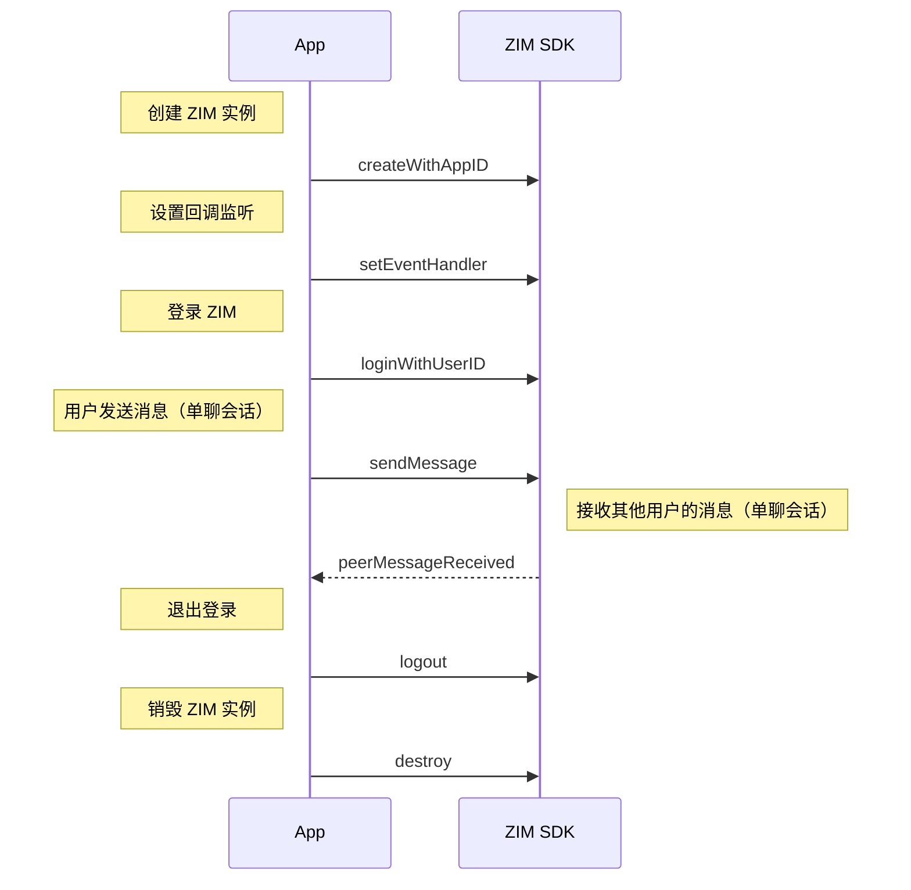

```mermaid
sequenceDiagram
    participant App
    participant ZIM_SDK as ZIM SDK

    Note left of App: 创建 ZIM 实例 
    App ->> ZIM_SDK: createWithAppID
    Note left of App: 设置回调监听
    App ->> ZIM_SDK: setEventHandler
    Note left of App: 登录 ZIM
    App ->> ZIM_SDK: loginWithUserID
    Note left of App: 用户发送消息（单聊会话）
    App ->> ZIM_SDK: sendMessage
    Note right of ZIM_SDK: 接收其他用户的消息（单聊会话）
    ZIM_SDK -->> App: peerMessageReceived
    Note left of App: 退出登录
    App ->> ZIM_SDK: logout
    Note left of App: 销毁 ZIM 实例
    App ->> ZIM_SDK: destroy
```